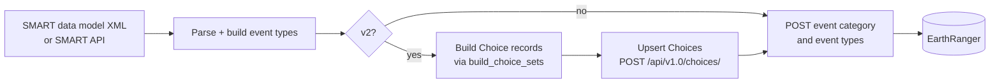

# MkDocs Documentation Site Implementation Plan

> **For agentic workers:** REQUIRED SUB-SKILL: Use superpowers:subagent-driven-development (recommended) or superpowers:executing-plans to implement this plan task-by-task. Steps use checkbox (`- [ ]`) syntax for tracking.

**Goal:** Stand up a GitHub-Pages-hosted MkDocs Material documentation site for `er-smart-sync` covering install, workflows, CLI reference, concepts, and troubleshooting — targeted at ~8 support staff + project managers over a one-year lifespan.

**Architecture:** Single-version MkDocs Material site sourced from `docs/`, built and deployed by a GH Action on push to main. Existing `docs/superpowers/` content (specs/plans) is excluded from the site via the `mkdocs-exclude` plugin. Mermaid diagrams for flow visualization; screenshot placeholders for SMART/ER UI images (4–6 high-value slots) the user fills in later.

**Tech Stack:** mkdocs-material, mkdocs-exclude, pymdownx (admonition, superfences, tabbed, snippets), Mermaid via superfences, GitHub Pages deploy via `gh-deploy`.

**Branch:** create new branch `feature/docs-site` from `main`. Do not commit to `main` directly.

---

## File structure

| Path | Action | Responsibility |
|---|---|---|
| `mkdocs.yml` | create | Site config, theme, plugins, navigation, Markdown extensions |
| `pyproject.toml` | modify | Add `[docs]` optional extras: `mkdocs-material`, `mkdocs-exclude` |
| `.github/workflows/docs.yml` | create | Build + deploy on push to `main` (paths-filtered to `docs/**`, `mkdocs.yml`, the workflow file itself) |
| `docs/index.md` | create | Landing page (what + who + quick links) |
| `docs/getting-started/install.md` | create | Install with `uv pip install`, verify, optional extras |
| `docs/getting-started/first-run.md` | create | Generate config template, validate-config, inspect-datamodel, dry-run |
| `docs/getting-started/config.md` | create | YAML structure, required vs optional fields, env vars |
| `docs/workflows/push-datamodel.md` | create | Full procedure with Mermaid + 1 screenshot slot |
| `docs/workflows/populate-choices.md` | create | When + why; inline vs standalone; reading stats; 1 screenshot slot |
| `docs/workflows/inspect-datamodel.md` | create | File vs API examples; reading the v1 vs v2 print output |
| `docs/workflows/sync-events.md` | create | **Skeleton** stub |
| `docs/workflows/sync-patrols.md` | create | **Skeleton** stub |
| `docs/cli-reference/overview.md` | create | Global flags; subcommand list with one-liners |
| `docs/cli-reference/datamodel.md` | create | Full flag listing, common invocations, exit semantics |
| `docs/cli-reference/choices.md` | create | Same shape as datamodel |
| `docs/cli-reference/inspect-datamodel.md` | create | Same shape |
| `docs/cli-reference/config-template.md` | create | Quick reference; sample output |
| `docs/cli-reference/events.md` | create | **Skeleton** stub |
| `docs/cli-reference/patrols.md` | create | **Skeleton** stub |
| `docs/cli-reference/validate-config.md` | create | **Skeleton** stub |
| `docs/cli-reference/list-cas.md` | create | **Skeleton** stub |
| `docs/concepts/ca-identifier.md` | create | Bracketed convention, extraction, Mermaid + 1 screenshot slot |
| `docs/concepts/event-type-version.md` | create | v1 vs v2 differences, when to choose each, 1 screenshot slot |
| `docs/concepts/choices.md` | create | ER Choice records, upsert, field naming, `$ref` pattern |
| `docs/troubleshooting.md` | create | 6–8 known errors with diagnosis + fix |
| `docs/changelog.md` | create | **Skeleton** stub (curated by release) |
| `docs/images/.gitkeep` | create | Image directory placeholder |
| `docs/images/README.md` | create | Index of screenshot slots + instructions for capture/replace |
| `README.md` | modify | Trim to landing-page summary; link to docs site |

The plan's own existing files under `docs/superpowers/` stay put; mkdocs.yml excludes them via `mkdocs-exclude`.

---

## Conventions for every task

- New branch `feature/docs-site` from `main`. Commit each task separately.
- After each content task: run `.venv/bin/mkdocs serve` locally and confirm the page renders + appears in nav. If installing the dep for the first time, run `uv pip install -e ".[docs]"` first.
- Mermaid diagrams use ` ```mermaid ` fenced blocks (enabled by `pymdownx.superfences` config).
- Screenshot slots are markdown image references pointing at `docs/images/<name>.png` plus a TODO admonition naming what to capture.
- Skeleton stubs are real Markdown files with `# <Title>` + a 1-line "this page covers X; full content TBD" line + an admonition flagging the stub. They're navigation-real but content-light.
- `er-smart-sync` is hyphenated in prose; the package import path is `er_smart_sync`.
- Commit messages use conventional-commits style (`docs:`, `chore(docs):`, `feat(docs):`).

---

## Task 1: Branch, infrastructure, and minimal site that renders

**Files:**
- Modify: `pyproject.toml`
- Create: `mkdocs.yml`
- Create: `docs/index.md`
- Create: `docs/images/.gitkeep`

- [ ] **Step 1: Create branch from main**

```bash
cd /Users/chrisdo/padas/earthranger-smart-utils
git checkout main
git pull
git checkout -b feature/docs-site
```

- [ ] **Step 2: Add `[docs]` extras to `pyproject.toml`**

Open `pyproject.toml` and find the existing `[project.optional-dependencies]` block (alongside `dev`, `gcp`, etc.). Add:

```toml
[project.optional-dependencies]
# ... existing entries kept ...
docs = [
    "mkdocs-material>=9.5",
    "mkdocs-exclude>=1.0",
]
```

If `[project.optional-dependencies]` doesn't exist yet, create it with just the `docs` block above.

- [ ] **Step 3: Install docs deps locally**

```bash
.venv/bin/pip install -e ".[docs]"
```

Expected: `mkdocs-material` and `mkdocs-exclude` resolve and install. Mkdocs becomes available as `.venv/bin/mkdocs`.

- [ ] **Step 4: Create `mkdocs.yml` (minimal config to start)**

Create `/Users/chrisdo/padas/earthranger-smart-utils/mkdocs.yml`:

```yaml
site_name: er-smart-sync
site_description: SMART Connect ↔ EarthRanger sync CLI for support staff
site_url: https://padas.github.io/earthranger-smart-utils/
repo_url: https://github.com/PADAS/earthranger-smart-utils
repo_name: PADAS/earthranger-smart-utils
edit_uri: edit/main/docs/

theme:
  name: material
  features:
    - navigation.tabs
    - navigation.sections
    - navigation.expand
    - navigation.path
    - navigation.top
    - search.suggest
    - search.highlight
    - content.code.copy
    - content.code.annotate
    - content.action.edit
    - toc.follow
  palette:
    - media: "(prefers-color-scheme: light)"
      scheme: default
      primary: indigo
      accent: indigo
      toggle:
        icon: material/brightness-7
        name: Switch to dark mode
    - media: "(prefers-color-scheme: dark)"
      scheme: slate
      primary: indigo
      accent: indigo
      toggle:
        icon: material/brightness-4
        name: Switch to light mode

plugins:
  - search
  - exclude:
      glob:
        - "superpowers/**"

markdown_extensions:
  - admonition
  - attr_list
  - md_in_html
  - tables
  - toc:
      permalink: true
  - pymdownx.details
  - pymdownx.tabbed:
      alternate_style: true
  - pymdownx.highlight:
      anchor_linenums: true
  - pymdownx.inlinehilite
  - pymdownx.snippets
  - pymdownx.superfences:
      custom_fences:
        - name: mermaid
          class: mermaid
          format: !!python/name:pymdownx.superfences.fence_code_format
  - pymdownx.emoji:
      emoji_index: !!python/name:material.extensions.emoji.twemoji
      emoji_generator: !!python/name:material.extensions.emoji.to_svg

nav:
  - Home: index.md
```

(More nav entries get added in Task 2 as pages are created.)

- [ ] **Step 5: Create `docs/index.md` placeholder + image directory**

```bash
mkdir -p /Users/chrisdo/padas/earthranger-smart-utils/docs/images
touch /Users/chrisdo/padas/earthranger-smart-utils/docs/images/.gitkeep
```

Create `/Users/chrisdo/padas/earthranger-smart-utils/docs/index.md`:

```markdown
# er-smart-sync

SMART Connect ↔ EarthRanger synchronization, for support staff and project managers.

This is a placeholder — full content lands in a later task.
```

- [ ] **Step 6: Verify mkdocs builds and serves**

```bash
.venv/bin/mkdocs serve --strict
```

Expected: site starts on `http://127.0.0.1:8000/`. Hit Ctrl-C to stop. `--strict` ensures any reference/link warnings fail the build.

Then run the full build to verify gh-pages output:

```bash
.venv/bin/mkdocs build --strict
```

Expected: no warnings, `site/` directory created. Verify `ls site/index.html` exists.

Add `site/` to `.gitignore` if not already there:

```bash
echo "site/" >> /Users/chrisdo/padas/earthranger-smart-utils/.gitignore
```

- [ ] **Step 7: Commit**

```bash
cd /Users/chrisdo/padas/earthranger-smart-utils
git add pyproject.toml mkdocs.yml docs/index.md docs/images/.gitkeep .gitignore
git commit -m "feat(docs): scaffold MkDocs Material site infrastructure"
```

---

## Task 2: Create all skeleton pages and final navigation

**Files:**
- Create: 17 markdown files under `docs/` (stubs for everything except `docs/index.md` which exists)
- Modify: `mkdocs.yml` (full nav structure)

- [ ] **Step 1: Create every page as a stub**

For each path below, write a 3–4 line stub. Use this template (substituting `<Title>` and `<one-line>`):

```markdown
# <Title>

<one-line description of what this page covers>

!!! note "Placeholder"
    Full content is being written. Check back soon, or open the source markdown
    for what's planned.
```

Create these 22 files (paths relative to `/Users/chrisdo/padas/earthranger-smart-utils/`):

```
docs/getting-started/install.md          — title: Installation
docs/getting-started/first-run.md        — title: First run
docs/getting-started/config.md           — title: Configuration
docs/workflows/push-datamodel.md         — title: Push a SMART data model into EarthRanger
docs/workflows/populate-choices.md       — title: Populate choices
docs/workflows/inspect-datamodel.md      — title: Inspect a data model
docs/workflows/sync-events.md            — title: Sync events (ER → SMART)
docs/workflows/sync-patrols.md           — title: Sync patrols (ER → SMART)
docs/cli-reference/overview.md           — title: CLI overview
docs/cli-reference/datamodel.md          — title: datamodel
docs/cli-reference/choices.md            — title: choices
docs/cli-reference/inspect-datamodel.md  — title: inspect-datamodel
docs/cli-reference/events.md             — title: events
docs/cli-reference/patrols.md            — title: patrols
docs/cli-reference/validate-config.md    — title: validate-config
docs/cli-reference/list-cas.md           — title: list-cas
docs/cli-reference/config-template.md    — title: config-template
docs/concepts/ca-identifier.md           — title: The CA identifier
docs/concepts/event-type-version.md      — title: Event-type version (v1 vs v2)
docs/concepts/choices.md                 — title: ER Choice records
docs/troubleshooting.md                  — title: Troubleshooting
docs/changelog.md                        — title: Changelog
```

For each, create the parent directory first if needed (e.g. `mkdir -p docs/getting-started`).

For the one-line descriptions, use these (matching the navigation order below):

- `getting-started/install.md`: Install er-smart-sync and verify it runs.
- `getting-started/first-run.md`: Confirm credentials work and preview what a sync would do, without writing anything.
- `getting-started/config.md`: Configure er-smart-sync with a YAML file or CLI flags.
- `workflows/push-datamodel.md`: Sync a SMART conservation area's data model into EarthRanger as event categories and event types.
- `workflows/populate-choices.md`: Upsert SMART option sets into EarthRanger as Choice records — required for v2 event types.
- `workflows/inspect-datamodel.md`: Preview what `datamodel` would push to EarthRanger, without making any writes.
- `workflows/sync-events.md`: Poll events from EarthRanger and publish them via the message broker (ER → SMART).
- `workflows/sync-patrols.md`: Poll patrols from EarthRanger and publish them via the message broker (ER → SMART).
- `cli-reference/overview.md`: Global flags and a summary of every subcommand.
- `cli-reference/datamodel.md`: Reference for `er-smart-sync datamodel`.
- `cli-reference/choices.md`: Reference for `er-smart-sync choices`.
- `cli-reference/inspect-datamodel.md`: Reference for `er-smart-sync inspect-datamodel`.
- `cli-reference/events.md`: Reference for `er-smart-sync events`.
- `cli-reference/patrols.md`: Reference for `er-smart-sync patrols`.
- `cli-reference/validate-config.md`: Reference for `er-smart-sync validate-config`.
- `cli-reference/list-cas.md`: Reference for `er-smart-sync list-cas`.
- `cli-reference/config-template.md`: Reference for `er-smart-sync config-template`.
- `concepts/ca-identifier.md`: How the bracketed `[CODE]` in a SMART CA label flows through to EarthRanger.
- `concepts/event-type-version.md`: How v1 and v2 event-type schemas differ and which one er-smart-sync produces.
- `concepts/choices.md`: How er-smart-sync upserts SMART option sets as EarthRanger Choice records.
- `troubleshooting.md`: Common error messages and how to fix them.
- `changelog.md`: Notable changes by version.

- [ ] **Step 2: Update `mkdocs.yml` `nav` to include every page**

Replace the existing `nav:` block in `mkdocs.yml` with:

```yaml
nav:
  - Home: index.md
  - Getting started:
    - Installation: getting-started/install.md
    - First run: getting-started/first-run.md
    - Configuration: getting-started/config.md
  - Workflows:
    - Push a data model: workflows/push-datamodel.md
    - Populate choices: workflows/populate-choices.md
    - Inspect a data model: workflows/inspect-datamodel.md
    - Sync events: workflows/sync-events.md
    - Sync patrols: workflows/sync-patrols.md
  - CLI reference:
    - Overview: cli-reference/overview.md
    - datamodel: cli-reference/datamodel.md
    - choices: cli-reference/choices.md
    - inspect-datamodel: cli-reference/inspect-datamodel.md
    - events: cli-reference/events.md
    - patrols: cli-reference/patrols.md
    - validate-config: cli-reference/validate-config.md
    - list-cas: cli-reference/list-cas.md
    - config-template: cli-reference/config-template.md
  - Concepts:
    - CA identifier: concepts/ca-identifier.md
    - Event-type version: concepts/event-type-version.md
    - Choices: concepts/choices.md
  - Troubleshooting: troubleshooting.md
  - Changelog: changelog.md
```

- [ ] **Step 3: Verify build**

```bash
.venv/bin/mkdocs build --strict
```

Expected: no warnings. Strict mode catches missing nav targets or broken links.

- [ ] **Step 4: Commit**

```bash
git add docs/ mkdocs.yml
git commit -m "docs: skeleton pages for every nav entry"
```

---

## Task 3: Write `docs/index.md` landing page

**Files:**
- Modify: `docs/index.md`

- [ ] **Step 1: Replace placeholder with full content**

Overwrite `docs/index.md`:

```markdown
# er-smart-sync

**SMART Connect ↔ EarthRanger synchronization**, packaged as a Python CLI for the
PADAS support team and project managers.

## What it does

Three sync flows in one tool:

1. **Push a data model** (SMART → ER) — turn a SMART conservation area's data model
   and configurable model overlays into EarthRanger event categories, event types,
   and the underlying Choice records that v2 event types reference.
2. **Sync events** (ER → SMART) — poll EarthRanger events and forward them through
   the message broker for routing back into SMART.
3. **Sync patrols** (ER → SMART) — poll EarthRanger patrols (with track points,
   segment events, and attached files) and forward them the same way.

## Who this is for

- **Support staff** rolling out new conservation areas or troubleshooting a sync.
- **Project managers** verifying that data flows match expectations.

If you're a developer working on the codebase itself, see the
[GitHub repository](https://github.com/PADAS/earthranger-smart-utils) and the
[USAGE.md](https://github.com/PADAS/earthranger-smart-utils/blob/main/USAGE.md)
reference.

## Start here

- **First time using this tool?** → [Installation](getting-started/install.md) →
  [First run](getting-started/first-run.md)
- **Need to push a SMART data model into ER?** →
  [Push a data model](workflows/push-datamodel.md)
- **Hitting an error?** → [Troubleshooting](troubleshooting.md)
- **Looking up a specific flag?** → [CLI reference](cli-reference/overview.md)

## How this site is organized

| Section | What's there |
|---|---|
| **Getting started** | Install, first-run smoke test, configuration |
| **Workflows** | Step-by-step procedures for each sync flow |
| **CLI reference** | Every flag for every subcommand |
| **Concepts** | Background on what's being synced and why (no Python required) |
| **Troubleshooting** | Common errors and their fixes |
```

- [ ] **Step 2: Verify locally**

```bash
.venv/bin/mkdocs serve --strict
```

Open `http://127.0.0.1:8000/`. Verify the landing page renders, links work, navigation is correct. Ctrl-C to stop.

- [ ] **Step 3: Commit**

```bash
git add docs/index.md
git commit -m "docs(index): write landing page"
```

---

## Task 4: Write Getting Started — install, first-run, config

**Files:**
- Modify: `docs/getting-started/install.md`
- Modify: `docs/getting-started/first-run.md`
- Modify: `docs/getting-started/config.md`

- [ ] **Step 1: Write `docs/getting-started/install.md`**

```markdown
# Installation

## Prerequisites

- **Python 3.10 or newer.** Check with `python3 --version`.
- **`uv`** (recommended) or `pip` for installing the package.
- **Read access to the `PADAS/earthranger-smart-utils` GitHub repository.**

## Install from the repo

Clone the repository and install in editable mode:

```bash
git clone git@github.com:PADAS/earthranger-smart-utils.git
cd earthranger-smart-utils
uv pip install -e ".[dev]"
```

The CLI is registered as `er-smart-sync`. Verify it installed:

```bash
er-smart-sync --help
```

You should see the list of subcommands (`datamodel`, `choices`, `events`,
`patrols`, `inspect-datamodel`, `validate-config`, `list-cas`,
`config-template`).

## Optional extras

| Extra | When to install | Command |
|---|---|---|
| `gcp` | Production runs using GCP Pub/Sub + GCS storage | `uv pip install -e ".[gcp]"` |
| `tracing` | OpenTelemetry tracing | `uv pip install -e ".[tracing]"` |
| `docs` | Local preview of this documentation site | `uv pip install -e ".[docs]"` |

Combine multiple: `uv pip install -e ".[dev,gcp,docs]"`.

## Verify

Run the test suite to confirm the install works end-to-end:

```bash
pytest -q
```

You should see all tests passing.

## Next

→ [First run](first-run.md) — confirm your credentials work and preview a sync
without making any writes.
```

- [ ] **Step 2: Write `docs/getting-started/first-run.md`**

```markdown
# First run

This page walks through a no-writes "does it work" check against a test
EarthRanger tenant and a local SMART data model XML file. Every step here is
safe — nothing is POSTed to EarthRanger until the very last optional step,
and even then only if you remove `--dry-run`.

## 1. Generate a config template

```bash
er-smart-sync config-template > sync.yaml
```

This writes a fully-commented YAML template to `sync.yaml`. Open it in your
editor.

## 2. Fill in your credentials

At minimum, set the `earthranger:` section:

```yaml
earthranger:
  id: my-tenant            # any identifier; used for state tracking
  endpoint: https://your-tenant.pamdas.org/api/v1.0
  token: "<your token>"    # OR provide login + password
```

If you'll also be syncing from the SMART API (vs a local file), fill in the
`smart:` section similarly.

See [Configuration](config.md) for the full reference.

## 3. Validate the credentials

```bash
er-smart-sync validate-config --config sync.yaml
```

This makes one read-only request to each service to confirm the credentials
work. Expected output: `OK` lines for each. If you see `FAIL`, the message
will tell you what's wrong (typically a wrong token or endpoint URL).

## 4. Preview a data model push

If you have a SMART data model XML file:

```bash
er-smart-sync inspect-datamodel \
  --config sync.yaml \
  --from-file path/to/datamodel.xml \
  --ca-identifier FOASF
```

This prints exactly what would be created in EarthRanger — event types,
choices, fields — without writing anything. Read the output and verify it
matches what you expect.

See [Inspect a data model](../workflows/inspect-datamodel.md) for details on
reading the output.

## 5. Dry-run the real push

```bash
er-smart-sync --dry-run datamodel \
  --config sync.yaml \
  --from-file path/to/datamodel.xml \
  --ca-identifier FOASF
```

`--dry-run` intercepts every write and logs what would have happened. Reads
still hit EarthRanger (so the synchronizer can plan correct intended writes),
but nothing changes on the server.

Expected output: log lines for each event type and choice that would be created
or updated, then a summary like:

```
Datamodel sync summary:
  categories_created: 0  (would: 1)
  ...
```

## 6. The real run (when you're ready)

Drop `--dry-run`:

```bash
er-smart-sync datamodel \
  --config sync.yaml \
  --from-file path/to/datamodel.xml \
  --ca-identifier FOASF
```

The summary at the end shows what changed. Re-running the same command should
report all event types and choices as `unchanged` — the tool is idempotent.

## Next

→ [Workflows: Push a data model](../workflows/push-datamodel.md) — full
procedure with diagrams.
```

- [ ] **Step 3: Write `docs/getting-started/config.md`**

```markdown
# Configuration

Most subcommands accept either a `--config <file>.yaml` flag or individual CLI
flags. The YAML form is recommended for repeatable runs.

## Generating a template

```bash
er-smart-sync config-template > sync.yaml
```

The output includes every field with inline comments. Edit it in your editor.

## YAML structure

```yaml
smart:
  endpoint: https://smart.example.org/server
  login: smart-user
  password: smart-secret
  version: "7.5.7"
  use_language_code: en
  ca_uuids:
    - 00000000-0000-0000-0000-000000000000
  configurable_models_lists: {}
  provider_key: smart_connect

earthranger:
  id: my-tenant
  endpoint: https://your-tenant.pamdas.org/api/v1.0
  token: ""
  login: ""
  password: ""
  client_id: das_web_client
  event_type_version: v2          # v1 or v2; default v2
  choices_base_url: /api/v2.0/schemas
```

## Required vs optional

### `smart:` section

| Field | Required? | Notes |
|---|---|---|
| `endpoint` | when using `--smart-api` | Full SMART Connect server URL |
| `login` / `password` | when using `--smart-api` | SMART credentials |
| `version` | optional (defaults to `"7.0"`) | SMART Connect server version |
| `use_language_code` | optional (defaults to `en`) | Language for resolving display names |
| `ca_uuids` | required for `datamodel`/`events`/`patrols` from API | List of CA UUIDs to sync |
| `configurable_models_lists` | optional | Per-CA configurable-model overlay metadata |
| `provider_key` | optional (defaults to `smart_connect`) | Routes messages downstream |

### `earthranger:` section

| Field | Required? | Notes |
|---|---|---|
| `id` | required | Any string — used as a state-store key |
| `endpoint` | required | EarthRanger API root (typically `.../api/v1.0`) |
| `token` | one of token / login+password | Preferred for service accounts |
| `login` + `password` | one of token / login+password | Falls back to OAuth |
| `client_id` | optional (default `das_web_client`) | OAuth client for password auth |
| `event_type_version` | optional (default `v2`) | Which ER event-type API to use; see [Event-type version](../concepts/event-type-version.md) |
| `choices_base_url` | optional (default `/api/v2.0/schemas`) | Prefix for v2 `$ref` URLs |

## Environment variables

`--network-timeout` (the process-wide socket-timeout ceiling) can be set via the
`ER_SMART_SYNC_NETWORK_TIMEOUT` environment variable. Useful for CI/CD where
the flag can't easily be passed.

## CLI flags override the config file

Any CLI flag overrides the equivalent YAML field. So you can keep credentials
in `sync.yaml` and pass `--event-type-version v1` on the command line to
override for a specific run.

## Multiple environments

A common pattern: one YAML per environment.

```bash
er-smart-sync datamodel --config configs/staging.yaml ...
er-smart-sync datamodel --config configs/production.yaml ...
```

Keep credentials out of version control — `.env`-style files or your team's
secret manager work fine.

## Next

→ [First run](first-run.md) if you haven't done one yet
→ [Workflows](../workflows/push-datamodel.md) for full procedures
```

- [ ] **Step 4: Verify locally**

```bash
.venv/bin/mkdocs serve --strict
```

Walk through Getting Started in the browser. Verify all three pages render, internal links work, code blocks have copy buttons.

- [ ] **Step 5: Commit**

```bash
git add docs/getting-started/
git commit -m "docs: write Getting Started section"
```

---

## Task 5: Write `workflows/push-datamodel.md` with Mermaid + screenshot slot

**Files:**
- Modify: `docs/workflows/push-datamodel.md`
- Create: `docs/images/README.md` (first task that adds a screenshot slot)

- [ ] **Step 1: Write the workflow page**

Overwrite `docs/workflows/push-datamodel.md`:

```markdown
# Push a SMART data model into EarthRanger

The `datamodel` subcommand pushes a SMART conservation area's structure into
EarthRanger as event categories, event types, and (on v2) the underlying
Choice records.

## What gets created



For each conservation area you sync, you get:

- **One event category** in EarthRanger, named with your `--ca-identifier`.
- **One event type per SMART category leaf** under that event category.
- **One Choice record per option** of every LIST/MLIST/TREE attribute (v2 only),
  upserted before the event types so the schemas' `$ref` URLs resolve.

## File-based or API-based?

Two modes:

=== "File-based"

    Load the SMART data model from a local XML file. Use this when you have
    the file on your workstation (exported from SMART Connect's data model
    editor) and don't need to authenticate with SMART.

    ```bash
    er-smart-sync datamodel \
      --config sync.yaml \
      --from-file ~/***REMOVED***.datamodel.xml \
      --ca-identifier JKPERU
    ```

    `--ca-identifier` is **required** in this mode; it becomes the
    EarthRanger event-category identifier. See
    [The CA identifier](../concepts/ca-identifier.md) for details.

=== "API-based"

    Fetch the data model directly from SMART Connect. Use this when you want
    to sync the current state of a SMART CA without exporting an XML first.

    ```bash
    er-smart-sync datamodel \
      --config sync.yaml \
      --smart-ca-uuid 0a1b2c3d-4e5f-6789-abcd-ef0123456789
    ```

    The `--ca-identifier` is extracted from the CA's label (the
    `[BRACKETED]` short code). If the label doesn't have brackets, you'll see
    a clear error and need to either fix the label in SMART Connect or fall
    back to the file-based mode.

## Configurable model overlays

If a CA has a configurable model (a curated overlay that turns selected
attributes/options on or off for ranger use), supply it with
`--cm-from-file`:

```bash
er-smart-sync datamodel \
  --config sync.yaml \
  --from-file ~/datamodel.xml \
  --cm-from-file ~/datamodel.cm.xml \
  --ca-identifier JKPERU
```

By default this pushes **only** the configurable model as an event category.
Add `--include-base-datamodel` to also push the underlying base data model as
a separate event category.

When multiple configurable models share a SMART CA, pass an explicit
`--cm-uuid <uuid>` per run to namespace the event-type values and avoid
collisions.

## v1 vs v2 event types

`er-smart-sync` defaults to **v2** event types, which is the current
EarthRanger event-type API shape. To target the legacy v1 shape, pass
`--event-type-version v1` or set `event_type_version: v1` in the config.

See [Event-type version](../concepts/event-type-version.md) for the full
comparison and migration notes.

## Reading the summary

At the end of each run you'll see:

```
Datamodel sync summary:
  categories_created: 1
  categories_existing: 0
  event_types_created: 18
  event_types_updated: 0
  event_types_unchanged: 0
  event_types_skipped_by_mode: 0
  event_types_skipped_by_conflict: 0
  event_types_errored: 0
  choices_created: 929
  choices_updated: 0
  choices_unchanged: 0
  choices_deactivated: 0
  choices_errored: 0
```

What each counter means:

- **`*_created`** — record didn't exist in EarthRanger before this run.
- **`*_updated`** — record existed; we PATCHed it because something drifted.
- **`*_unchanged`** — record matched what we'd post; no-op.
- **`event_types_skipped_by_mode`** — `--mode create-only` or `update-only` filtered this one out.
- **`event_types_skipped_by_conflict`** — value already exists in the *other*
  event-type API version (v1 collides with v2); won't auto-PATCH cross-version.
  See [Troubleshooting](../troubleshooting.md).
- **`*_errored`** — POST/PATCH failed; check logs above the summary for the
  specific error.
- **`choices_deactivated`** — an existing Choice was marked inactive because
  the configurable model removed it.

A clean re-run against the same data should show only `*_unchanged` and (for
categories) `categories_existing` counts.

## After the push

You can verify in EarthRanger's admin UI:


*EarthRanger admin → Event Categories. Your new category appears at the top.*

!!! note "Screenshot placeholder"
    Replace the image above with a screenshot of the EarthRanger admin
    `Event Categories` view immediately after a successful `datamodel`
    push. See `docs/images/README.md` for the full list of slots.

If event types use dropdowns (LIST/MLIST/TREE attributes), the choices appear
via the `$ref` URL — see [Populate choices](populate-choices.md).

## Recovery from problems

- **A run reports `*_errored > 0`.** Look at the log lines above the summary —
  each error has the offending event type or choice and the underlying error
  message. Fix and re-run.
- **The choices phase aborts the event-type phase.** Intentional: if any
  Choice upsert fails, we don't POST event types whose `$ref` URLs would
  resolve to broken/missing records.
- **Duplicate-key conflicts.** ER's event-type `value` is unique tenant-wide
  *across* v1 and v2. If you previously pushed v1 and now push v2 (or vice
  versa), you'll see `event_types_skipped_by_conflict` counts. Use the
  EarthRanger server-side migrate endpoint
  (`POST /api/v2.0/activity/eventtypes/migrate/`) to convert.

See [Troubleshooting](../troubleshooting.md) for the full catalogue of common
errors.

## Related

- [Populate choices](populate-choices.md) — the choices upsert in more detail
- [Inspect a data model](inspect-datamodel.md) — preview before pushing
- [`datamodel` CLI reference](../cli-reference/datamodel.md) — every flag
- [Event-type version](../concepts/event-type-version.md) — v1 vs v2
```

- [ ] **Step 2: Create `docs/images/README.md` (screenshot slot tracker)**

```markdown
# Screenshot slots

This document is an internal index of the screenshot placeholders embedded in
the documentation. Replace the listed `.png` files with real screenshots when
you're capturing them — the docs will pick them up automatically.

## Capture conventions

- **PNG format**, sized to roughly 1200×800 (Material renders responsively).
- **Crop tightly** to the relevant UI region. Don't include browser chrome
  unless it's contextually important.
- **Redact** any tenant-specific names/tokens that aren't part of the canonical
  example (`FOASF`, `JKPERU`, etc.).
- **Light theme** for consistency unless the screenshot is specifically about
  dark-mode behavior.

## Slots to fill

| Filename | Where it's used | What to capture |
|---|---|---|
| `er-event-category-list.png` | `workflows/push-datamodel.md` | EarthRanger admin → Event Categories list, with a freshly-pushed category at the top. |
| `er-event-type-with-choices.png` | `workflows/populate-choices.md` | EarthRanger admin → Event Types → one event type's detail view, showing a CHOICE_LIST field with a populated dropdown. |
| `smart-ca-label-bracketed.png` | `concepts/ca-identifier.md` | SMART Connect → Conservation Areas list, showing a CA whose name follows the `Foasf Reserve [FOASF]` convention. |
| `er-event-type-form-v2.png` | `concepts/event-type-version.md` | EarthRanger admin → Event Type detail view, showing the v2 form (`unevaluatedProperties`, ui sections). |

When you replace a placeholder, delete its row from this table.
```

- [ ] **Step 3: Verify**

```bash
.venv/bin/mkdocs build --strict
```

Expected: warning about the missing image file `er-event-category-list.png` — that's expected for now (it's a placeholder slot). The build itself succeeds.

If `--strict` fails because of the missing image, change the verification to `mkdocs build` (no `--strict`) until screenshots are added — but verify the page still renders correctly in `mkdocs serve`.

- [ ] **Step 4: Commit**

```bash
git add docs/workflows/push-datamodel.md docs/images/README.md
git commit -m "docs(workflows): push-datamodel procedure with diagram"
```

---

## Task 6: Write `workflows/populate-choices.md`

**Files:**
- Modify: `docs/workflows/populate-choices.md`

- [ ] **Step 1: Write the workflow page**

Overwrite `docs/workflows/populate-choices.md`:

```markdown
# Populate choices

The `choices` subcommand upserts SMART option sets as EarthRanger `Choice`
records. **You don't usually run this directly** — `datamodel` runs it
inline before pushing event types. This page covers when and why you might
run it standalone.

## Why choices?

EarthRanger's v2 event-type schemas don't embed dropdown options inline.
Instead, every choice attribute references a separate `Choice` record set
via a `$ref` URL:

```json
"sector": {
  "type": "array",
  "items": {
    "type": "string",
    "anyOf": [
      {"$ref": "/api/v2.0/schemas/choices.json?field=et5e6b96f4_sector"}
    ]
  }
}
```

For that `$ref` to resolve, the `Choice` records with `field=et5e6b96f4_sector`
must exist in EarthRanger first. The `choices` subcommand creates them.

See [ER Choice records](../concepts/choices.md) for the full background on
how field names are derived and what gets stored.

## Inline vs standalone

=== "Inline (default for v2)"

    Run `datamodel --event-type-version v2 ...` and the choices phase runs
    automatically before event types are POSTed:

    ```bash
    er-smart-sync datamodel \
      --config sync.yaml \
      --from-file ~/datamodel.xml \
      --ca-identifier JKPERU
    ```

    The summary line shows both phases:

    ```
    choices_created: 929
    choices_updated: 0
    choices_unchanged: 0
    ...
    event_types_created: 18
    ```

=== "Standalone"

    Run `choices` alone, without touching event types:

    ```bash
    er-smart-sync choices \
      --config sync.yaml \
      --from-file ~/datamodel.xml \
      --cm-from-file ~/datamodel.cm.xml
    ```

    Useful for:

    - Pre-warming a new EarthRanger tenant before doing a `datamodel` push.
    - Re-syncing only the choices after a configurable-model change, without
      re-PATCHing every event type.
    - Diagnosing choice-specific issues in isolation.

## --skip-choices

If you've already run `choices` separately and want to push event types
without re-running the choices phase, use `--skip-choices`:

```bash
er-smart-sync datamodel \
  --config sync.yaml \
  --from-file ~/datamodel.xml \
  --ca-identifier JKPERU \
  --skip-choices
```

This is rare — the choices phase is fast on re-runs (only the GETs run, no
writes) — but useful in long-running scripts where you want to manage the
phases independently.

## Aborting on choice errors

If any Choice upsert errors out, the synchronizer **aborts the event-type
phase for that conservation area**. The reasoning: pushing event types whose
`$ref` URLs resolve to missing/incomplete Choice records produces broken
dropdowns in EarthRanger, which is worse than skipping the push and surfacing
the error.

You'll see a warning in the log:

```
WARNING: Aborting event-type push for CA <uuid>: <N> choice operations failed.
Investigate the choice errors above before re-running.
```

Fix the choice errors (typically network-related; see
[Troubleshooting](../troubleshooting.md)) and re-run. The choices phase is
idempotent — already-correct records are no-op.

## Reading the choices summary

```
Choices done: created=929 updated=1 unchanged=0 deactivated=0 errored=0
```

- **`created`** — new Choice record in EarthRanger.
- **`updated`** — Choice existed; we PATCHed `display` or `ordernum` to match
  current SMART state.
- **`unchanged`** — Choice matched SMART; no-op.
- **`deactivated`** — Choice existed and was active in ER, but the
  configurable-model now marks it inactive (or it was removed from the SMART
  data model). We soft-deleted it via PATCH.
- **`errored`** — POST/PATCH failed; check the log above for the specific
  field/value.

## After the upsert

In EarthRanger's admin UI:


*An event type's detail view shows each CHOICE_LIST attribute resolving to
its underlying Choice records via `$ref`.*

!!! note "Screenshot placeholder"
    Replace with a screenshot of an EarthRanger event-type detail view that
    has at least one populated CHOICE_LIST dropdown. See
    `docs/images/README.md`.

## Related

- [Push a data model](push-datamodel.md) — the parent workflow that runs
  choices inline
- [ER Choice records](../concepts/choices.md) — concepts and field-name
  derivation
- [`choices` CLI reference](../cli-reference/choices.md) — flag-by-flag
```

- [ ] **Step 2: Verify**

```bash
.venv/bin/mkdocs serve --strict
```

Or `mkdocs build` if `--strict` complains about the placeholder images.

- [ ] **Step 3: Commit**

```bash
git add docs/workflows/populate-choices.md
git commit -m "docs(workflows): populate-choices procedure"
```

---

## Task 7: Write `workflows/inspect-datamodel.md`

**Files:**
- Modify: `docs/workflows/inspect-datamodel.md`

- [ ] **Step 1: Write the page**

Overwrite `docs/workflows/inspect-datamodel.md`:

```markdown
# Inspect a data model

`inspect-datamodel` prints exactly what `datamodel` would create or update in
EarthRanger — without making any writes. Use it as a sanity check before
running a real sync, or to diff what's in SMART against what's in ER.

## When to use it

- Before running `datamodel` for the first time against a new CA.
- After a SMART data model change, to confirm only the expected event types
  will be affected.
- To learn what a configurable-model overlay does without committing it.
- To preview the v2 schema and `$ref` URLs before they hit ER's meta-schema.

## File-based or API-based?

=== "File-based"

    ```bash
    er-smart-sync inspect-datamodel \
      --from-file ~/datamodel.xml \
      --ca-identifier JKPERU
    ```

    `--ca-identifier` is required, just like with `datamodel`.

=== "API-based"

    ```bash
    er-smart-sync inspect-datamodel \
      --config sync.yaml \
      --smart-ca-uuid 0a1b2c3d-4e5f-6789-abcd-ef0123456789
    ```

    The identifier is extracted from the CA label.

## Reading v2 output

For v2 (the default), the output groups event types by category and shows
each event type's fields with their UI types and `$ref` URLs (for choice
fields):

```
CA: JKPERU
Event types: 18
  active:   18
  inactive: 0

- jkperu_incidents_caza_furtiva
    display: Caza furtiva
    fields:
      signo_de_caza: array (ui=CHOICE_LIST/DROPDOWN, enum=...)
      acciontomada: array (ui=CHOICE_LIST/DROPDOWN, enum=...)
      ...

Choice sets: 60
- field: et5e6b96f4_signo_de_caza
    options (4):
      - rastro: Rastro
      - trampa: Trampa
      - ...
```

For each choice-bearing field, you'll see the derived `Choice.field` name
(the `et<hash>_<attr>` part). This is what `datamodel` will POST as
EarthRanger `Choice` records.

## Reading v1 output

If you pass `--event-type-version v1`, the output is closer to v1's inline-
enum format:

```
CA: JKPERU
Event types: 18
  active:   18
  inactive: 0

- jkperu_incidents_caza_furtiva
    display: Caza furtiva
    fields:
      signo_de_caza: array (enum=['rastro', 'trampa', 'red', 'cazador'])
      ...
```

No separate Choice section — v1 embeds the options directly in the schema.

## Tips

- `inspect-datamodel` honors your config's `choices_base_url` so the
  previewed `$ref` URLs match what a real sync would emit.
- Configurable models are supported: `--cm-from-file path/to/cm.xml`.
- Output goes to stdout, so you can pipe it: `... | grep -A5 mineria`.

## Related

- [Push a data model](push-datamodel.md) — the real sync
- [`inspect-datamodel` CLI reference](../cli-reference/inspect-datamodel.md)
- [Event-type version](../concepts/event-type-version.md)
```

- [ ] **Step 2: Verify**

```bash
.venv/bin/mkdocs serve --strict
```

- [ ] **Step 3: Commit**

```bash
git add docs/workflows/inspect-datamodel.md
git commit -m "docs(workflows): inspect-datamodel procedure"
```

---

## Task 8: Write CLI reference — overview + datamodel + choices + inspect-datamodel + config-template

**Files:**
- Modify: `docs/cli-reference/overview.md`
- Modify: `docs/cli-reference/datamodel.md`
- Modify: `docs/cli-reference/choices.md`
- Modify: `docs/cli-reference/inspect-datamodel.md`
- Modify: `docs/cli-reference/config-template.md`

- [ ] **Step 1: Write `docs/cli-reference/overview.md`**

```markdown
# CLI overview

Every `er-smart-sync` invocation starts with the same shape:

```bash
er-smart-sync [GLOBAL FLAGS] <subcommand> [SUBCOMMAND FLAGS]
```

## Global flags

| Flag | Description |
|---|---|
| `--verbose`, `-v` | Enable DEBUG logging from `er_smart_sync` (noisy libraries stay at WARNING). |
| `--dry-run` | Log intended writes without sending them to ER or the message broker. Reads still hit EarthRanger. |
| `--network-timeout SECONDS` | Process-wide ceiling on blocking socket operations. Default 600s. Pass `0` to disable and rely on each library's own timeouts. Also configurable via `ER_SMART_SYNC_NETWORK_TIMEOUT`. |
| `--help` | Show help for `main` or any subcommand. |

## Subcommands

| Subcommand | What it does |
|---|---|
| [`datamodel`](datamodel.md) | Push a SMART data model into EarthRanger as event categories and event types. |
| [`choices`](choices.md) | Upsert SMART option sets as EarthRanger `Choice` records (v2 prerequisite). |
| [`inspect-datamodel`](inspect-datamodel.md) | Preview what `datamodel` would push, without making writes. |
| [`events`](events.md) | Poll events from EarthRanger and publish them via the message broker. |
| [`patrols`](patrols.md) | Poll patrols from EarthRanger and publish them via the message broker. |
| [`validate-config`](validate-config.md) | Check that SMART and EarthRanger credentials work. |
| [`list-cas`](list-cas.md) | List the conservation areas available on a SMART server. |
| [`config-template`](config-template.md) | Print a fully-commented YAML config template. |

## Common patterns

**Get help on a subcommand:**

```bash
er-smart-sync datamodel --help
```

**Run with verbose logging:**

```bash
er-smart-sync -v datamodel ...
```

**Preview before writing:**

```bash
er-smart-sync --dry-run datamodel ...
```

**Override the network timeout for a long-running sync:**

```bash
er-smart-sync --network-timeout 1800 datamodel ...   # 30 minutes
```

## Exit codes

- **0** — success (or success with skipped/errored counts > 0; check the
  summary line).
- **non-zero** — usage error, fatal exception, or `choices`/`datamodel` had
  errored counts that triggered an explicit ClickException.
```

- [ ] **Step 2: Write `docs/cli-reference/datamodel.md`**

```markdown
# `datamodel`

Push a SMART data model into EarthRanger as event categories and event types.

```bash
er-smart-sync datamodel [OPTIONS]
```

## Required (one of)

- `--from-file PATH` (with `--ca-identifier ID`) — load a SMART data model
  from a local XML file
- `--smart-api URL` + SMART credentials + `--smart-ca-uuid UUID` — fetch from
  the SMART Connect API

## Options

| Flag | Default | Description |
|---|---|---|
| `--config FILE` | — | YAML config file path. CLI flags override config values. |
| `--from-file PATH` | — | Load data model from a local XML file. Requires `--ca-identifier`. |
| `--cm-from-file PATH` | — | Load a configurable model overlay. Requires `--from-file`. |
| `--cm-uuid UUID` | zero UUID | Configurable-model UUID. Required when loading multiple configurable models for the same CA, to avoid event-type value collisions. |
| `--include-base-datamodel` | off | With `--cm-from-file`, also push the base data model as its own ER category. |
| `--ca-identifier ID` | required for `--from-file` | Short alphanumeric code (2–30 chars; letters, digits, hyphens, underscores) used as the ER event-category identifier. Ignored for API-based runs (extracted from the CA label instead). |
| `--mode {both,create-only,update-only}` | `both` | Restrict to creating only new event types, updating only existing ones, or both. |
| `--event-type-version {v1,v2}` | from config or v2 | Which ER event-type API version to target. |
| `--skip-choices` | off | Skip the choices upsert phase (v2 only). Use if `er-smart-sync choices` was run separately. |
| `--smart-api URL` | from config | SMART Connect API URL. Required for API-based runs. |
| `--smart-username NAME` | from config | SMART login. |
| `--smart-password PASSWORD` | from config | SMART password. |
| `--smart-version VERSION` | from config | SMART Connect server version. |
| `--smart-language CODE` | from config | Language code (e.g. `en`, `es`). |
| `--smart-ca-uuid UUID` (multiple) | from config | Conservation area UUID(s) for API-based runs. |
| `--er-endpoint URL` | from config | EarthRanger API root. |
| `--er-token TOKEN` | from config | EarthRanger token. |
| `--er-username NAME` | from config | EarthRanger login (fallback to password auth). |
| `--er-password PASSWORD` | from config | EarthRanger password. |
| `--er-id ID` | `cli` | Integration ID (state-tracking key). |

## Common invocations

**File-based, v2 (default):**

```bash
er-smart-sync datamodel \
  --config sync.yaml \
  --from-file ~/datamodel.xml \
  --ca-identifier JKPERU
```

**File-based with configurable model:**

```bash
er-smart-sync datamodel \
  --config sync.yaml \
  --from-file ~/datamodel.xml \
  --cm-from-file ~/datamodel.cm.xml \
  --ca-identifier JKPERU \
  --include-base-datamodel
```

**API-based:**

```bash
er-smart-sync datamodel \
  --config sync.yaml \
  --smart-ca-uuid 0a1b2c3d-4e5f-6789-abcd-ef0123456789
```

**Update-only (won't create new event types):**

```bash
er-smart-sync datamodel \
  --config sync.yaml \
  --from-file ~/datamodel.xml \
  --ca-identifier JKPERU \
  --mode update-only
```

**Force v1 schemas:**

```bash
er-smart-sync datamodel \
  --config sync.yaml \
  --from-file ~/datamodel.xml \
  --ca-identifier JKPERU \
  --event-type-version v1
```

## Summary stats

Printed at the end of every run. See
[Push a data model — Reading the summary](../workflows/push-datamodel.md#reading-the-summary).

## See also

- [Workflow: Push a data model](../workflows/push-datamodel.md)
- [`choices`](choices.md)
- [`inspect-datamodel`](inspect-datamodel.md)
```

- [ ] **Step 3: Write `docs/cli-reference/choices.md`**

```markdown
# `choices`

Upsert SMART option sets as EarthRanger `Choice` records. Run as a standalone
step or let `datamodel` invoke it inline.

```bash
er-smart-sync choices [OPTIONS]
```

## Current limitations

Only file-based runs are supported (`--from-file` is required). SMART API
options are accepted on the command line for symmetry with other subcommands
but are not used by `choices` yet; `--smart-language` is the exception
(consulted for parsing the XML).

## Required

- `--from-file PATH`
- EarthRanger credentials (`--er-endpoint` + `--er-token`, or login/password)

## Options

| Flag | Default | Description |
|---|---|---|
| `--config FILE` | — | YAML config file path. |
| `--from-file PATH` | **required** | Local SMART data model XML. |
| `--cm-from-file PATH` | — | Configurable model overlay XML. |
| `--cm-uuid UUID` | zero UUID | Configurable-model UUID. |
| `--smart-language CODE` | `en` | Language code for XML parsing. |
| `--er-endpoint URL` | from config | EarthRanger API root. |
| `--er-token TOKEN` | from config | EarthRanger token. |
| `--er-username` / `--er-password` | from config | Alternative to token. |
| `--er-id ID` | `cli` | Integration ID. |

(Other SMART API flags are present in `--help` for symmetry but ignored.
A warning is logged if they're passed.)

## Invocations

**Pre-warm a new tenant:**

```bash
er-smart-sync choices \
  --config sync.yaml \
  --from-file ~/datamodel.xml \
  --cm-from-file ~/datamodel.cm.xml
```

**Dry-run:**

```bash
er-smart-sync --dry-run choices \
  --config sync.yaml \
  --from-file ~/datamodel.xml
```

## Exit codes

- **0** — success.
- **non-zero** — at least one Choice operation failed, OR the usage was
  invalid (e.g. missing `--from-file`).

## See also

- [Workflow: Populate choices](../workflows/populate-choices.md)
- [Concept: ER Choice records](../concepts/choices.md)
```

- [ ] **Step 4: Write `docs/cli-reference/inspect-datamodel.md`**

```markdown
# `inspect-datamodel`

Print what `datamodel` would create or update in EarthRanger — without making
writes.

```bash
er-smart-sync inspect-datamodel [OPTIONS]
```

## Required (one of)

- `--from-file PATH` + `--ca-identifier ID`
- `--smart-ca-uuid UUID` (with SMART credentials)

## Options

| Flag | Default | Description |
|---|---|---|
| `--config FILE` | — | YAML config file. |
| `--from-file PATH` | — | Local SMART data model XML. |
| `--cm-from-file PATH` | — | Configurable model overlay. |
| `--cm-uuid UUID` | zero UUID | CM UUID. |
| `--ca-identifier ID` | required for `--from-file` | 2–30 alphanumeric/dash/underscore. |
| `--ca-label LABEL` | `[INSPECT]` | Used in the printed "CA:" header. |
| `--smart-ca-uuid UUID` | — | Triggers API-based inspect. |
| `--event-type-version {v1,v2}` | from config or v2 | Which schema shape to print. |
| `--smart-*` | from config | SMART credentials for API-based inspect. |
| `--er-*` | from config | EarthRanger credentials (used for nothing in inspect, but accepted for symmetry). |

## Invocations

**File-based, v2:**

```bash
er-smart-sync inspect-datamodel \
  --from-file ~/datamodel.xml \
  --ca-identifier JKPERU
```

**File-based, v1:**

```bash
er-smart-sync inspect-datamodel \
  --from-file ~/datamodel.xml \
  --ca-identifier JKPERU \
  --event-type-version v1
```

**API-based:**

```bash
er-smart-sync inspect-datamodel \
  --config sync.yaml \
  --smart-ca-uuid 0a1b2c3d-4e5f-6789-abcd-ef0123456789
```

## Reading the output

See [Workflow: Inspect a data model](../workflows/inspect-datamodel.md) for
annotated examples of v1 and v2 output.

## See also

- [Workflow: Inspect a data model](../workflows/inspect-datamodel.md)
- [`datamodel`](datamodel.md)
```

- [ ] **Step 5: Write `docs/cli-reference/config-template.md`**

```markdown
# `config-template`

Print a fully-commented YAML config template to stdout.

```bash
er-smart-sync config-template [OPTIONS]
```

## Options

| Flag | Default | Description |
|---|---|---|
| `--output FILE` | — | Write to FILE instead of stdout. |

## Invocations

**Pipe to a file:**

```bash
er-smart-sync config-template > sync.yaml
```

**Equivalent with `--output`:**

```bash
er-smart-sync config-template --output sync.yaml
```

## What's in the template

Every field that `er-smart-sync` reads from a YAML config, with inline
comments explaining when each is needed and what the default value is. Edit
the file in your editor and pass it via `--config sync.yaml` to other
subcommands.

See [Configuration](../getting-started/config.md) for a field-by-field
explanation.

## See also

- [Getting started: Configuration](../getting-started/config.md)
```

- [ ] **Step 6: Verify**

```bash
.venv/bin/mkdocs serve --strict
```

- [ ] **Step 7: Commit**

```bash
git add docs/cli-reference/
git commit -m "docs(cli-reference): overview + datamodel + choices + inspect-datamodel + config-template"
```

---

## Task 9: Write Concepts — CA identifier (with diagram + screenshot)

**Files:**
- Modify: `docs/concepts/ca-identifier.md`

- [ ] **Step 1: Write the page**

Overwrite `docs/concepts/ca-identifier.md`:

```markdown
# The CA identifier

Every conservation area (CA) in EarthRanger is identified by a short code
derived from the SMART CA's label. This page explains the convention, how
the code is extracted, and what to do when a CA doesn't follow the
convention.

## The bracketed convention

SMART Connect CA labels follow this format:

```
Human-readable name [SHORTCODE]
```

Examples:

- `Foasf Reserve [FOASF]`
- `Jungle Keepers Peru [JKPERU]`
- `Ujung Kulon National Park [UKNP]`

The `[SHORTCODE]` is what becomes the EarthRanger event-category
identifier. It's typically 4–6 uppercase letters, but our validator accepts
2–30 characters of letters, digits, hyphens, and underscores.


*SMART Connect → Conservation Areas list. The bracketed `[FOASF]` is what flows through to EarthRanger.*

!!! note "Screenshot placeholder"
    Replace with a screenshot of SMART Connect's Conservation Areas list
    view, showing a CA whose name follows the bracketed convention. See
    `docs/images/README.md`.

## How extraction works

```mermaid
flowchart LR
    A["'Foasf Reserve [FOASF]'"] --> B[regex: r'\[(.*?)\]']
    B --> C["matches: ['FOASF']"]
    C --> D["take last match: 'FOASF'"]
    D --> E["lowercase + slugify"]
    E --> F["'foasf'"]
    F --> G[ER event-category identifier]
```

When there are multiple brackets, the **last** match wins. So
`[A] and [B]` → `B`. This is intentional — it lets you prefix labels with
arbitrary tags (`[ARCHIVED] Foasf Reserve [FOASF]`) without breaking the
identifier extraction.

## When the CA has no brackets

If a SMART CA label has no bracketed code, `er-smart-sync` can't extract an
identifier and will fail with an actionable error:

```
ValueError: Could not extract a CA identifier from SMART label
'Conservation Area Without Brackets' (ca_uuid=some-ca-uuid). The label
must contain a bracketed short code, e.g. 'Foasf Reserve [FOASF]'. Fix
the label in SMART Connect, or use --from-file with an explicit
--ca-identifier.
```

Two fixes:

1. **Edit the label in SMART Connect** to add the bracketed code. Preferred
   if you have admin rights to SMART. The label is human-visible and the
   convention is well-established across PADAS CAs.
2. **Fall back to file-based with explicit `--ca-identifier`.** Export the
   data model XML and pass the identifier directly:

   ```bash
   er-smart-sync datamodel \
     --from-file ~/datamodel.xml \
     --ca-identifier FOASF
   ```

## What the identifier flows into

The extracted identifier is used in three places:

1. **ER event-category `value`** (the slug) — `calculate_event_category_value(identifier)` produces e.g. `"foasf"` (lowercased, punctuation stripped).
2. **ER event-category `display`** — when there's a configurable model, the display is `f"{identifier} {cm_name}"`. With no CM, it's just `identifier`.
3. **Subject naming during patrol sync** — ranger subjects get suffixed with `f" ({identifier})"` so they're disambiguated across CAs.

The event-type `value` does **not** depend on the identifier — it's keyed by
CA UUID instead. So even if your CA label is malformed, event-type values
stay stable across CAs.

## Validation rules

The `--ca-identifier` CLI flag is validated client-side:

- **Length:** 2–30 characters.
- **Allowed characters:** `A-Z`, `a-z`, `0-9`, `_`, `-`.
- **Rejected:** spaces, dots, accents, anything outside the set above.

Examples:

| Input | Result |
|---|---|
| `FOASF` | ✅ accepted |
| `smart-import` | ✅ accepted |
| `FOO_BAR_99` | ✅ accepted |
| `f` | ❌ too short |
| `has spaces` | ❌ contains a space |
| `Côte` | ❌ contains a non-ASCII character |

## Related

- [Workflow: Push a data model](../workflows/push-datamodel.md)
- [Configuration](../getting-started/config.md)
```

- [ ] **Step 2: Verify**

```bash
.venv/bin/mkdocs serve --strict
```

- [ ] **Step 3: Commit**

```bash
git add docs/concepts/ca-identifier.md
git commit -m "docs(concepts): CA identifier — convention, extraction, validation"
```

---

## Task 10: Write Concepts — event-type version + choices

**Files:**
- Modify: `docs/concepts/event-type-version.md`
- Modify: `docs/concepts/choices.md`

- [ ] **Step 1: Write `docs/concepts/event-type-version.md`**

Overwrite the file:

```markdown
# Event-type version (v1 vs v2)

EarthRanger supports two coexisting event-type API versions. `er-smart-sync`
defaults to **v2**; v1 is supported for tenants that haven't migrated yet.
This page explains the differences and when to use each.

## Quick comparison

| Aspect | v1 | v2 |
|---|---|---|
| Endpoint | `/api/v1.0/activity/events/eventtypes/` | `/api/v2.0/activity/eventtypes/` |
| `schema` field | stringified JSON | JSON object (`{json: ..., ui: ...}`) |
| Schema spec | draft-04 + Jinja2 templates | **JSON Schema 2020-12**, strict |
| `category` field | UUID FK | category `value` slug |
| Choice attributes | inline `enum` in schema | `$ref` to separate `Choice` records |
| `readonly` | nested in schema | top-level field |
| UI metadata | n/a | dedicated `ui` block with sections, fields, parents |
| Inactive event types | soft-delete via DELETE | hard-delete (409 if in use) |

## When to use which

**Default: v2.** Use it unless you have a specific reason not to.

**Use v1 only if:**

- Your EarthRanger tenant hasn't enabled v2 yet (rare; check with the ER team).
- You're maintaining a legacy integration that downstream consumers expect to
  see in v1 shape.
- You're testing migration scenarios.

**Set the version per-run with the CLI flag** or per-config with the YAML:

```yaml
earthranger:
  event_type_version: v2   # or v1
```

```bash
er-smart-sync datamodel --event-type-version v1 ...
```

CLI flag overrides config.

## What `er-smart-sync` produces

### v2 schema shape

For every event type, `er-smart-sync` emits a meta-schema-valid v2 schema:

```json
{
  "schema": {
    "json": {
      "$schema": "https://json-schema.org/draft/2020-12/schema",
      "type": "object",
      "unevaluatedProperties": false,
      "properties": {
        "sector": {
          "type": "array",
          "title": "Sector",
          "description": "",
          "deprecated": false,
          "uniqueItems": true,
          "items": {
            "type": "string",
            "anyOf": [{"$ref": "/api/v2.0/schemas/choices.json?field=et5e6b96f4_sector"}]
          }
        }
      },
      "required": []
    },
    "ui": {
      "fields": {"sector": {"type": "CHOICE_LIST", "inputType": "DROPDOWN", "parent": "section-1", ...}},
      "headers": {},
      "order": ["section-1"],
      "sections": {"section-1": {"columns": 1, "isActive": true, "leftColumn": [...], "rightColumn": []}}
    }
  },
  "category": "jkperu",
  "readonly": false
}
```

Note: choices are referenced via `$ref`. The referenced records are created
by the choices phase before the event type is POSTed.

### v1 schema shape

Legacy form, simpler but less expressive:

```json
{
  "schema": "{\"schema\": {\"properties\": {\"sector\": {\"type\": \"array\", \"enum\": [\"riootros\", \"jk001\", ...]}}}}",
  "category": "<UUID>",
  "is_active": true
}
```

Choices are inlined in the schema. The `category` field is the UUID FK to the
event category, not the slug.


*An EarthRanger v2 event-type form, showing the `ui.sections` layout and a
populated CHOICE_LIST field.*

!!! note "Screenshot placeholder"
    Replace with a screenshot of the EarthRanger admin → Event Types →
    detail view for a v2 event type. See `docs/images/README.md`.

## Migrating between versions

EarthRanger's event-type `value` is unique tenant-wide **across both
versions**. You can't have the same `value` exist as both v1 and v2.

To convert an existing v1 event type to v2, use the EarthRanger server-side
migrate endpoint:

```
POST /api/v2.0/activity/eventtypes/migrate/
```

`er-smart-sync` doesn't wrap this endpoint yet. Call it directly via `curl`
or the EarthRanger admin UI.

## Related

- [Workflow: Push a data model](../workflows/push-datamodel.md)
- [Concept: Choices](choices.md) — the v2 `$ref` mechanism in detail
- [Configuration](../getting-started/config.md) — setting `event_type_version`
```

- [ ] **Step 2: Write `docs/concepts/choices.md`**

Overwrite the file:

```markdown
# ER Choice records

EarthRanger's `Choice` records hold the option values for dropdown fields
(LIST, MLIST, TREE in SMART; CHOICE_LIST in ER). In v2 event types, these
records live separately from the event-type schema and are referenced via
`$ref` URLs.

This page explains how `er-smart-sync` upserts those records, how the field
names are derived, and what to do when things go wrong.

## What a Choice record looks like

In EarthRanger's database (and the `/api/v1.0/choices/` REST endpoint),
each option is a row:

```json
{
  "id": "<uuid>",
  "model": "activity.event",
  "field": "et5e6b96f4_sector",
  "value": "jk001",
  "display": "Sector JK001",
  "ordernum": 0,
  "is_active": true
}
```

- **`model`** — what kind of object this choice belongs to. We always set
  `"activity.event"`.
- **`field`** — the dropdown identifier. All options for one dropdown share
  the same `field` value. This is what event-type schemas reference via
  `$ref`.
- **`value`** — the underlying SMART option key, sanitized to `^\w+$`.
- **`display`** — the human-visible label.
- **`ordernum`** — preserves the SMART option order.
- **`is_active`** — soft-delete flag. Inactive choices stay in the DB so
  historical events can still resolve.

ER enforces a unique constraint on `(tenant, model, field, value)` —
duplicate options for the same dropdown collide.

## How `field` names are derived

For every event type with a choice attribute, we derive a stable `field`
name:

```
et{8-hex}_{attr_key}
```

The 8 hex chars are `sha256(event_type_value)[:8]`. The attribute key is
sanitized to `^\w+$`. The total is capped at 40 characters (ER's column
limit).

Example: for event type `jkperu_incidents_caza_furtiva` and attribute
`signo_de_caza`, the field name is `et5e6b96f4_signo_de_caza`.

The hash makes the name unique across all event types in a tenant, without
needing a registry. The same SMART attribute referenced from two different
event types gets two different field names — they're isolated by design.

## The `$ref` URL

In a v2 event-type schema, choice fields look like:

```json
"signo_de_caza": {
  "type": "array",
  "uniqueItems": true,
  "items": {
    "type": "string",
    "anyOf": [
      {"$ref": "/api/v2.0/schemas/choices.json?field=et5e6b96f4_signo_de_caza"}
    ]
  }
}
```

EarthRanger's `choices.json` endpoint resolves this `$ref` to the active
Choice records with that `field` name, returning their `value` and
`display` for the dropdown.

If the referenced Choice records don't exist yet (because the choices phase
hasn't run, or was skipped), the dropdown renders empty.

## Upsert decision matrix

When `er-smart-sync choices` runs, for each option in each Choice set, it
decides one of these outcomes by comparing the SMART data against what ER
already has:

| ER state | SMART state | Outcome | Counter |
|---|---|---|---|
| Doesn't exist | Active | POST a new record | `created` |
| Exists, active, matches | Active, same display/ordernum | No-op | `unchanged` |
| Exists, active, drifted | Active, different display/ordernum | PATCH the diff | `updated` |
| Exists, inactive | Active | PATCH `is_active=True` (re-activate) | `updated` |
| Exists, active | Inactive (CM removed it) | PATCH `is_active=False` (soft-delete) | `deactivated` |
| Exists, but not in plan | (absent) | PATCH `is_active=False` (orphan) | `deactivated` |
| (any) | (any) | Network/server error | `errored` |

After processing all Choice sets, you see the summary:

```
Choices done: created=929 updated=1 unchanged=0 deactivated=0 errored=0
```

## Why the choices phase exists at all

v1 EarthRanger embedded dropdown options directly in the event-type schema
(`enum: ["jk001", "jk002", ...]`). v2 doesn't allow this — its meta-schema
rejects inline `enum` in choice fields, requiring `anyOf: [{$ref: ...}]`
instead.

So `er-smart-sync` had to add a layer that pre-creates the referenced
records. Without it, every v2 event-type POST would fail with
`Invalid JSON Schema: ... is not valid under any of the given schemas`.

## TREE handling

SMART TREE attributes have parent/child option hierarchies (e.g. `africa →
africa.kenya → africa.kenya.nairobi`). `er-smart-sync` **flattens to leaves**
— only the deepest options become Choice records.

Matching v1 behavior. ER's `Choice` model supports `sub_choice_of` for
hierarchical relations, but using it would change downstream behavior. Out
of scope for now.

## Related

- [Workflow: Populate choices](../workflows/populate-choices.md)
- [Concept: Event-type version](event-type-version.md)
- [`choices` CLI reference](../cli-reference/choices.md)
```

- [ ] **Step 3: Verify**

```bash
.venv/bin/mkdocs serve --strict
```

- [ ] **Step 4: Commit**

```bash
git add docs/concepts/event-type-version.md docs/concepts/choices.md
git commit -m "docs(concepts): event-type version + choices"
```

---

## Task 11: Write Troubleshooting

**Files:**
- Modify: `docs/troubleshooting.md`

- [ ] **Step 1: Write the page**

Overwrite `docs/troubleshooting.md`:

```markdown
# Troubleshooting

Common errors, their causes, and fixes. If you hit something not listed
here, check the verbose logs (`er-smart-sync -v ...`) and look for a stack
trace or warning above the failure point.

## `400: ... is not one of the available choices`

```
WARNING: ERClient: Fail attempt 1 of 1: {"field": ["Select a valid choice.
et5e6b96f4_sector is not one of the available choices."]}
```

**Cause:** ER's `/choices/?field=<X>` endpoint validates the `field=` query
value against the set of field names already in the database. For a fresh
tenant, no Choice has the derived `field` name yet, so the GET returns 400.

**Status: handled.** `er-smart-sync` catches this specific 400 and treats it
as "no existing records for this field", then proceeds to POST new records.
The warning still appears in the log but is benign — the sync continues
normally.

If you see this in your log, watch for the choices summary at the end:

```
Choices done: created=929 updated=0 unchanged=0 deactivated=0 errored=0
```

A non-zero `created` count confirms the workaround did its job.

## Every event type shows as `updated` on re-runs

**Cause:** ER serializes the v2 schema as a JSON string on GET (not a dict).
Earlier versions of `er-smart-sync` didn't parse the string back to a dict
before comparing, so the dict-vs-string comparison always reported a diff.

**Status: fixed in 5648b65.** Make sure you're on a current build:

```bash
git pull
uv pip install -e ".[dev]"
```

After the fix, a re-run of `datamodel` against unchanged input should
report:

```
event_types_unchanged: 18
event_types_updated: 0
event_types_created: 0
```

## The sync hangs silently after a few choice sets

**Cause:** A stalled HTTP request with no library-level timeout. Earlier
versions didn't bound socket operations, so a slow ER response or a TCP
connection drop would hang indefinitely.

**Status: fixed.** A process-wide socket timeout (default 600s) is set in
`_set_network_timeout`. After 600s of no activity on any socket, requests
raises and our `_retry` wrapper takes over.

If 600s is too short for your tenant (e.g., very large data models), bump
it:

```bash
er-smart-sync --network-timeout 1800 datamodel ...   # 30 minutes
```

Or set the env var:

```bash
export ER_SMART_SYNC_NETWORK_TIMEOUT=1800
```

Set to `0` to disable our timeout entirely and rely on each library's own.

## `Could not extract a CA identifier from SMART label ...`

```
ValueError: Could not extract a CA identifier from SMART label 'My Reserve'
(ca_uuid=some-ca-uuid). The label must contain a bracketed short code, e.g.
'Foasf Reserve [FOASF]'. Fix the label in SMART Connect, or use --from-file
with an explicit --ca-identifier.
```

**Cause:** API-based runs derive the identifier from the bracketed code in
the SMART CA label. If the label has no `[CODE]`, there's nothing to
extract.

**Two fixes:**

1. **Edit the label in SMART Connect** to add the bracketed code.
2. **Fall back to file-based:**

   ```bash
   er-smart-sync datamodel \
     --from-file ~/datamodel.xml \
     --ca-identifier MYRESERVE
   ```

See [Concept: CA identifier](concepts/ca-identifier.md) for the full story.

## Duplicate-key conflict on event-type POST

```
WARNING: Event type value 'jkperu_incidents_caza_furtiva' exists in this
tenant as v1; skipping the v1 push to avoid cross-version corruption.
Convert it via POST /api/v2.0/activity/eventtypes/migrate/ before retrying
v1.
```

**Cause:** ER's event-type `value` is unique tenant-wide *across* v1 and
v2. If you previously pushed v1 and now try v2 (or vice versa), the same
`value` exists under the other version.

**Fix:** call EarthRanger's server-side migrate endpoint:

```
POST /api/v2.0/activity/eventtypes/migrate/
```

This converts v1 records to v2 (or vice versa) without deleting them.
`er-smart-sync` doesn't wrap this endpoint yet — use `curl` or the
EarthRanger admin UI.

## CHOICE_LIST field rendered as plain text

**Cause:** Before a fix in commit `82c8fec`, if a configurable-model marked
all options of a LIST/MLIST/TREE attribute as inactive, `er-smart-sync`
would fall back to emitting a `TEXT` field. That changed the field's wire
type and broke tenants with historical events stored under the choice
schema.

**Status: fixed.** Choice-bearing SMART types now always emit `CHOICE_LIST`
with a `$ref`, even when the CM has deactivated every option. The Choice
records are still upserted (just marked `is_active=False`); ER renders an
empty dropdown until ops re-activate them.

If you're seeing this on an old build, update:

```bash
git pull && uv pip install -e ".[dev]"
```

## Authentication fails on EarthRanger

```
ERClient: 401 Bad credentials
```

**Causes (in rough order of likelihood):**

1. Wrong or expired `token`.
2. `endpoint` is correct but missing `/api/v1.0`.
3. Username/password used with the wrong `client_id`.

**Diagnose with `validate-config`:**

```bash
er-smart-sync validate-config --config sync.yaml
```

Prints OK/FAIL for each service, with the specific error message on FAIL.

## How to get more logs

For everything `er_smart_sync` emits at DEBUG level:

```bash
er-smart-sync -v datamodel ...
```

This adds detailed event-type-by-event-type diff information, choice-set
progress lines, and the HTTP responses that triggered each retry/fallback.

## Reporting a problem

When something goes wrong that isn't covered here, capture:

1. The exact command that triggered the issue.
2. The full output with `-v` (verbose) enabled.
3. The configuration YAML (with credentials redacted).
4. The SMART data model XML file or CA UUID being synced.

Open an issue at
https://github.com/PADAS/earthranger-smart-utils/issues with those four
pieces of context.
```

- [ ] **Step 2: Verify**

```bash
.venv/bin/mkdocs serve --strict
```

- [ ] **Step 3: Commit**

```bash
git add docs/troubleshooting.md
git commit -m "docs: troubleshooting catalogue"
```

---

## Task 12: Trim `README.md` to a landing page

**Files:**
- Modify: `README.md`

- [ ] **Step 1: Replace `README.md` with a trimmed version**

Overwrite `/Users/chrisdo/padas/earthranger-smart-utils/README.md`:

```markdown
# er-smart-sync

Synchronize [SMART Connect](https://smartconservationtools.org/) wildlife-monitoring
data with [EarthRanger](https://www.earthranger.com/).

## 📖 Full documentation

**https://padas.github.io/earthranger-smart-utils/**

Includes install instructions, step-by-step workflows for every sync flow,
a complete CLI reference, conceptual background, and troubleshooting.

## What it does

- **Datamodel sync** (SMART → ER) — turn SMART data models into EarthRanger
  event categories and event types.
- **Event sync** (ER → SMART) — poll EarthRanger events and forward them via
  message broker.
- **Patrol sync** (ER → SMART) — poll EarthRanger patrols with track points
  and attached files.

## Quick install

```bash
git clone git@github.com:PADAS/earthranger-smart-utils.git
cd earthranger-smart-utils
uv pip install -e ".[dev]"
er-smart-sync --help
```

See the [Installation page](https://padas.github.io/earthranger-smart-utils/getting-started/install/)
for prerequisites, optional extras, and verification steps.

## License

Apache License 2.0. See [LICENSE](LICENSE).
```

- [ ] **Step 2: Verify the trim didn't break repo links**

```bash
.venv/bin/mkdocs build --strict
```

The mkdocs build doesn't process the repo-root README, but the site's
landing page references it, so verify the rendered site is still coherent.

- [ ] **Step 3: Commit**

```bash
git add README.md
git commit -m "docs: trim README to a landing summary; point at docs site"
```

---

## Task 13: GitHub Action to build + deploy on push

**Files:**
- Create: `.github/workflows/docs.yml`

- [ ] **Step 1: Create the workflow**

```bash
mkdir -p /Users/chrisdo/padas/earthranger-smart-utils/.github/workflows
```

Create `/Users/chrisdo/padas/earthranger-smart-utils/.github/workflows/docs.yml`:

```yaml
name: docs

on:
  push:
    branches: [main]
    paths:
      - docs/**
      - mkdocs.yml
      - .github/workflows/docs.yml
  # Allow manual triggers from the Actions UI.
  workflow_dispatch:

permissions:
  contents: write

jobs:
  build-and-deploy:
    runs-on: ubuntu-latest
    steps:
      - name: Checkout
        uses: actions/checkout@v4
        with:
          # gh-deploy needs full history to commit to gh-pages.
          fetch-depth: 0

      - name: Set up Python
        uses: actions/setup-python@v5
        with:
          python-version: "3.12"

      - name: Install docs dependencies
        run: |
          python -m pip install --upgrade pip
          pip install mkdocs-material mkdocs-exclude

      - name: Build site
        run: mkdocs build --strict

      - name: Deploy to gh-pages
        run: mkdocs gh-deploy --force
```

- [ ] **Step 2: Verify the workflow file is valid YAML**

```bash
.venv/bin/python -c "import yaml; yaml.safe_load(open('.github/workflows/docs.yml'))" && echo "valid YAML"
```

Expected: `valid YAML`.

- [ ] **Step 3: Commit**

```bash
git add .github/workflows/docs.yml
git commit -m "ci: add docs build + deploy workflow"
```

- [ ] **Step 4: Manual step (cannot be automated)**

After merging this branch:

1. Go to https://github.com/PADAS/earthranger-smart-utils/settings/pages
2. Under **Build and deployment**, set **Source** to **Deploy from a branch**.
3. Set the branch to **gh-pages** (created automatically on first deploy
   from the workflow) and folder to **/ (root)**.
4. Save. Within a few minutes, the site is live at
   https://padas.github.io/earthranger-smart-utils/.

**Note for the executing agent:** This GitHub Pages settings step requires
admin UI access and cannot be automated. Include the instructions in the PR
description so a human admin can complete the rollout.

---

## Task 14: Final smoke + open PR

- [ ] **Step 1: Run the full local build one more time**

```bash
.venv/bin/mkdocs build --strict
```

Expected: no warnings except the four missing image files for screenshot
slots (these are expected — they're tracked in `docs/images/README.md` for
the user to fill in later).

If `--strict` fails on the missing images, that's fine: the rendered site
still has the alt text + admonition explaining what to capture. Confirm
the page reads acceptably with no image:

```bash
.venv/bin/mkdocs serve
```

Visit `http://127.0.0.1:8000/concepts/ca-identifier/` and confirm the
admonition explains the placeholder. Ctrl-C.

- [ ] **Step 2: Run the project's existing test suite**

```bash
.venv/bin/pytest -q
```

Expected: all tests still pass (no test changes — this is a docs-only
branch).

- [ ] **Step 3: Push the branch and open a PR**

```bash
git push origin feature/docs-site
```

Then open a PR via gh:

```bash
gh pr create --title "Add MkDocs Material documentation site" --body "$(cat <<'EOF'
## Summary

Stand up a GitHub-Pages-hosted MkDocs Material documentation site for
er-smart-sync. Targeted at ~8 support staff + project managers over a
one-year lifespan.

## What's in the site

- **Getting started** — install, first run, configuration
- **Workflows** — push-datamodel, populate-choices, inspect-datamodel
  (the high-value pages). Sync-events and sync-patrols stay as skeleton
  stubs for now.
- **CLI reference** — every flag for the production-critical subcommands
  (datamodel, choices, inspect-datamodel, config-template). Skeleton stubs
  for events, patrols, validate-config, list-cas.
- **Concepts** — CA identifier, event-type version, choices
- **Troubleshooting** — 7 known errors with diagnosis and fix
- **Mermaid diagrams** in the workflows and CA-identifier pages
- **Screenshot placeholder slots** at four high-value spots (see
  `docs/images/README.md` for capture instructions)

## Manual deployment step

After this merges, set GitHub Pages to deploy from the `gh-pages` branch
(repo settings → Pages → source: Deploy from a branch → branch:
gh-pages → / (root)). The workflow creates the branch on first run.

## Follow-ups

- Capture and replace the four screenshot placeholders.
- Expand sync-events/sync-patrols workflows and the four skeleton CLI
  references as questions surface from support staff.
- Curate `changelog.md` at the first tagged release.
EOF
)"
```

- [ ] **Step 4: Verify Copilot review is requested**

Per the saved feedback memory, Copilot review should be requested on every
PR. If the repo's auto-request setting is enabled, this happens
automatically. Otherwise, remind the user to click Reviewers → Copilot in
the PR UI.

---

## Out of scope (do not implement here)

These are deliberately deferred. Don't grow the plan to include them:

- **Real screenshots.** Placeholders shipped; the user (or a follow-up PR)
  captures and replaces.
- **Full content for skeleton stubs** (`sync-events.md`, `sync-patrols.md`,
  `events.md`, `patrols.md`, `validate-config.md`, `list-cas.md`,
  `changelog.md`). Expand as questions surface.
- **Versioned docs** (`mike` plugin). Not needed for a 1-year tool.
- **Search analytics** or telemetry. Not needed at this scale.
- **Translated content.** English only.

If anything in this list becomes a real blocker during implementation,
**stop and surface it** rather than expanding the plan.
