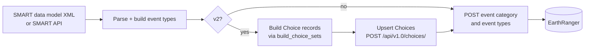

# Push a SMART data model into EarthRanger

The `datamodel` subcommand pushes a SMART conservation area's structure into
EarthRanger as event categories, event types, and (on v2) the underlying
Choice records.

## What gets created



For each conservation area you sync, you get:

- **One event category** in EarthRanger, named with your `--ca-identifier`.
- **One event type per SMART category leaf** under that event category.
- **One Choice record per option** of every LIST/MLIST/TREE attribute (v2 only),
  upserted before the event types so the schemas' `$ref` URLs resolve.

## File-based or API-based?

Two modes:

=== "File-based"

    Load the SMART data model from a local XML file. Use this when you have
    the file on your workstation (exported from SMART Connect's data model
    editor) and don't need to authenticate with SMART.

    ```bash
    er-smart-sync datamodel \
      --config sync.yaml \
      --from-file ~/junglekeepers-peru.datamodel.xml \
      --ca-identifier JKPERU
    ```

    `--ca-identifier` is **required** in this mode; it becomes the
    EarthRanger event-category identifier. See
    [The CA identifier](../concepts/ca-identifier.md) for details.

=== "API-based"

    Fetch the data model directly from SMART Connect. Use this when you want
    to sync the current state of a SMART CA without exporting an XML first.

    ```bash
    er-smart-sync datamodel \
      --config sync.yaml \
      --smart-ca-uuid 0a1b2c3d-4e5f-6789-abcd-ef0123456789
    ```

    The `--ca-identifier` is extracted from the CA's label (the
    `[BRACKETED]` short code). If the label doesn't have brackets, you'll see
    a clear error and need to either fix the label in SMART Connect or fall
    back to the file-based mode.

## Configurable model overlays

If a CA has a configurable model (a curated overlay that turns selected
attributes/options on or off for ranger use), supply it with
`--cm-from-file`:

```bash
er-smart-sync datamodel \
  --config sync.yaml \
  --from-file ~/datamodel.xml \
  --cm-from-file ~/datamodel.cm.xml \
  --ca-identifier JKPERU
```

By default this pushes **only** the configurable model as an event category.
Add `--include-base-datamodel` to also push the underlying base data model as
a separate event category.

When multiple configurable models share a SMART CA, pass an explicit
`--cm-uuid <uuid>` per run to namespace the event-type values and avoid
collisions.

## v1 vs v2 event types

`er-smart-sync` defaults to **v2** event types, which is the current
EarthRanger event-type API shape. To target the legacy v1 shape, pass
`--event-type-version v1` or set `event_type_version: v1` in the config.

See [Event-type version](../concepts/event-type-version.md) for the full
comparison and migration notes.

## Reading the summary

At the end of each run you'll see:

```
Datamodel sync summary:
  categories_created: 1
  categories_existing: 0
  event_types_created: 18
  event_types_updated: 0
  event_types_unchanged: 0
  event_types_skipped_by_mode: 0
  event_types_skipped_by_conflict: 0
  event_types_errored: 0
  choices_created: 929
  choices_updated: 0
  choices_unchanged: 0
  choices_deactivated: 0
  choices_errored: 0
```

What each counter means:

- **`*_created`** — record didn't exist in EarthRanger before this run.
- **`*_updated`** — record existed; we PATCHed it because something drifted.
- **`*_unchanged`** — record matched what we'd post; no-op.
- **`event_types_skipped_by_mode`** — `--mode create-only` or `update-only` filtered this one out.
- **`event_types_skipped_by_conflict`** — value already exists in the *other*
  event-type API version (v1 collides with v2); won't auto-PATCH cross-version.
  See [Troubleshooting](../troubleshooting.md).
- **`*_errored`** — POST/PATCH failed; check logs above the summary for the
  specific error.
- **`choices_deactivated`** — an existing Choice was marked inactive because
  the configurable model removed it.

A clean re-run against the same data should show only `*_unchanged` and (for
categories) `categories_existing` counts.

## After the push

You can verify in EarthRanger's admin UI:


*EarthRanger admin → Event Categories. Your new category appears at the top.*

!!! note "Screenshot placeholder"
    Replace the image above with a screenshot of the EarthRanger admin
    `Event Categories` view immediately after a successful `datamodel`
    push. See `docs/images/README.md` for the full list of slots.

If event types use dropdowns (LIST/MLIST/TREE attributes), the choices appear
via the `$ref` URL — see [Populate choices](populate-choices.md).

## Recovery from problems

- **A run reports `*_errored > 0`.** Look at the log lines above the summary —
  each error has the offending event type or choice and the underlying error
  message. Fix and re-run.
- **The choices phase aborts the event-type phase.** Intentional: if any
  Choice upsert fails, we don't POST event types whose `$ref` URLs would
  resolve to broken/missing records.
- **Duplicate-key conflicts.** ER's event-type `value` is unique tenant-wide
  *across* v1 and v2. If you previously pushed v1 and now push v2 (or vice
  versa), you'll see `event_types_skipped_by_conflict` counts. Use the
  EarthRanger server-side migrate endpoint
  (`POST /api/v2.0/activity/eventtypes/migrate/`) to convert.

See [Troubleshooting](../troubleshooting.md) for the full catalogue of common
errors.

## Related

- [Populate choices](populate-choices.md) — the choices upsert in more detail
- [Inspect a data model](inspect-datamodel.md) — preview before pushing
- [`datamodel` CLI reference](../cli-reference/datamodel.md) — every flag
- [Event-type version](../concepts/event-type-version.md) — v1 vs v2
